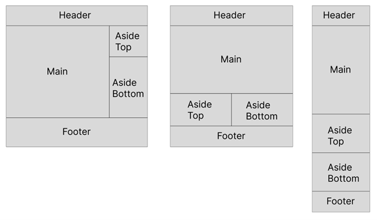

# Simons Foundation Coding Challenge

The goal of this challenge is to understand how you solve problems and some of your familiarity with the tools we use. We're asking that you spend no more than 3 hours in total working on this challenge. We do not expect perfect responses. Please complete as much as you can within that time frame. We suggest giving yourself around 45 minutes to an hour for each of the three problems. 

Below are three problems. In all three cases, we primarily want to see how you approach each problem, so please be sure to explain your choices in writing, include your questions, and comment on what you're observing or what decisions you're making. It's more important to us that we can understand your approach and thinking than it is that every single issue is addressed.

Your response can be sent as a number of files, links to private or public gists or Github repositories, or another format that allows us to review the work as well as your comments, questions, and other notes. Please email your response to Janet Mui no later than Friday, June 9 at 5:00 PM

## Problem 1: JavaScript bug fixing
Below is a JavaScript snippet. We'd like for you to start off by writing down your comments on the code, pointing out any errors, noting opportunities for improvement, and raising any questions you have. What would you change and how would you change it? Does everything make sense? Why or why not? We do not expect you to be able to turn this into fully functional code.

```
foo = 3;
bar = false;
const everyday = new Date();
if (foo == 'three') {
    var obj = { 
        hello: 123, 
        world: 456 
    };
    for (let i = 0, i < obj.length; ++i) {
        document.appendChild(document.createElement('div')); 
        document.getElementById('xyz').style.border = '1px solid #000'; 
        document.getElementById('xyza').style.color = 'white'; 
        document.getElementById('xyzab').style.marginTop = '160px'; 
        document.getElementById('xyzabc').style.border = '1px solid #123'; 
        while (child.nodeName() !== 'span' && (p = child.parentNode));
        foo = obj[multiply(i, i - 3)];
    }
}
const multiply = (x, y) => x * y;
```

## Problem 2: CSS Grid Layout
See the layouts below, which are, from left to right, for desktop (1280px wide and up), tablet (768-1279px), and mobile (<768px).
The challenge is to produce markup and CSS that would generate this responsive layout without using any media queries.
The "deliverable" for this challenge can be as simple as an HTML file with styling in the head, a CodePen or gist on Github, etc., though you can choose to use a preprocessor like Sass, PostCSS, Stylus, or Less and organize the files any way you'd like.

### For reference:
A series of articles by Rachel Andrew on CSS Grid:
https://www.smashingmagazine.com/2020/01/understanding-css-grid-container/
Grid by Example:
https://gridbyexample.com/learn/
CSS Tricks's Complete Guide to CSS Grid: https://css-tricks.com/snippets/css/complete-guide-grid/
MDN web docs on grid: https://developer.mozilla.org/en-US/docs/Web/CSS/CSS_Grid_Layout


 
## Problem 3: Closures
Closure, in computer programming, is an interesting concept about which many people are not quite clear. Could you please briefly describe, in plain English, what a closure is? Could you please show and explain to us briefly, with simple code examples (in JavaScript), how closure can be applied to the following case:
1.	Currying.

Can you tell us why the following Javascript code doesn’t work correctly?
How would you fix it?

```
function count() {
	let counter;
	for (counter = 0; counter < 3; counter++) {
    	setTimeout(function () {
        	console.log('counter value is ' + counter);
    	}, 100);
	}
}
count();
```
